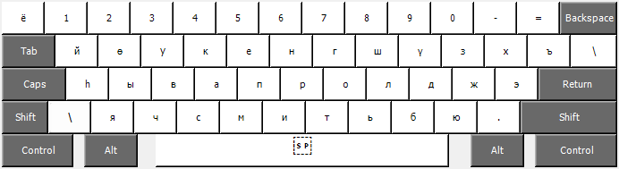
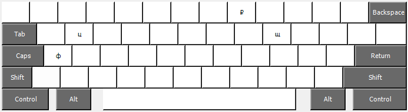

# Buryad language keyboard layout based on Russian cyrillic keyboard layout

## Installation

Just download .dmg file and run, follow the guide in installer.

And after installing you have to restart/re-login your computer/session

## Description

Below rare used cyrillic letters replaced:

    ф - h

    щ - ү

    ц - ө

Keyboard layout:

For using replaced Russian letters you could use `Option` described below:

Layout scheme idea from [buryadxelen.com](https://buryadxelen.com/)

Created by [Ukelele](https://software.sil.org/ukelele/)
