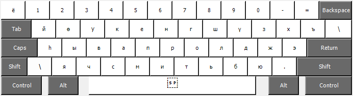
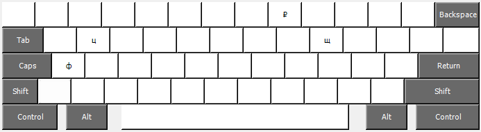

# Buryad language keyboard layout based on Russian cyrillic keyboard layout

Below rare used cyrillic letters replaced:
    ф - 
    щ - 
    ц - 

Keyboard layout:

For using replaced Russian letters you could use `ctrl + alt` described below:

Layout scheme idea from [buryadxelen.com](https://buryadxelen.com/)

Created by [Microsoft Keyboard Layout Creator 1.4](https://www.microsoft.com/en-us/download/details.aspx?id=102134)